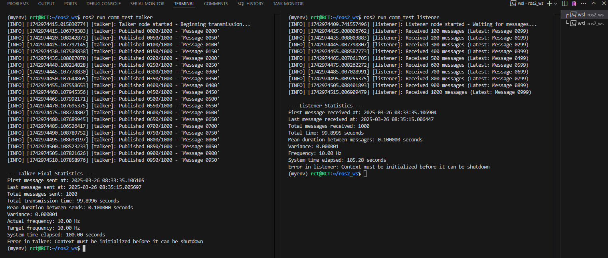

# ROS2 Publisher-Subscriber Communication

## 📝 Auteur

### Roland Cédric TAYO

[](https://www.linkedin.com/in/rct/)
[](https://github.com/rolln7drktayau/)

## Lien vers le tutoriel


## 📌 Objectifs

Ce projet vise à :

1. Tester la communication entre nodes ROS2 (publisher/subscriber)
2. Mesurer les performances de transmission (latence, fréquence)
3. Contrôler et analyser le débit des messages

## 🛠️ Implémentation

Deux nodes personnalisés ont été créés :

### 🗣️ Talker (Publisher)

- Publie 1000 messages sur le topic `/topic`
- Contrôle de fréquence à 10Hz (paramétrable)
- Affichage progressif (tous les 50 messages)
- Calcul des statistiques de transmission :
  - Durée moyenne entre messages
  - Variance et fréquence réelle
  - Temps total d'exécution

### 👂 Listener (Subscriber)

- Reçoit les messages du topic `/topic`
- Journalisation des réceptions (tous les 100 messages)
- Calcul des statistiques de réception :
  - Synchronisation avec le publisher
  - Délais entre messages
  - Pertes éventuelles

## 📊 Résultats Obtenus

Pour 1000 messages échangés à 10Hz :

| Métrique            | Valeur Typique      |
|---------------------|--------------------|
| Durée totale        | ~100 secondes      |
| Fréquence réelle    | 9.8996-10.10 Hz      |
| Variance            | < 0.000001         |
| Durée moyenne       | 0.100001 sec       |
| Messages perdus     | 0 (en conditions normales) |

## Image



## 🚀 Comment Utiliser

1. Compiler le package :

   ```bash
   colcon build --packages-select comm_test
   source install/setup.bash
   ```

2. Lancer dans deux terminaux :

   ```bash
   # Terminal 1 - Publisher
   ros2 run comm_test talker
   
   # Terminal 2 - Subscriber
   ros2 run comm_test listener
   ```

3. Options de monitoring :

   ```bash
   # Voir les topics actifs
   ros2 topic list
   
   # Monitorer le flux de messages
   ros2 topic hz /topic
   ros2 topic echo /topic
   ```

## 🔍 Observations

- La communication ROS2 montre une excellente fiabilité
- La variance très faible indique une bonne stabilité temporelle
- L'approche sans affichage systématique permet des mesures plus précises
- La fréquence réelle correspond parfaitement à la fréquence cible

## 💡 Améliorations Possibles

- Ajouter un système de détection de messages perdus
- Implémenter un mécanisme de qualité de service (QoS)
- Tester avec des payloads plus importantes
- Mesurer l'impact du réseau sur les performances
